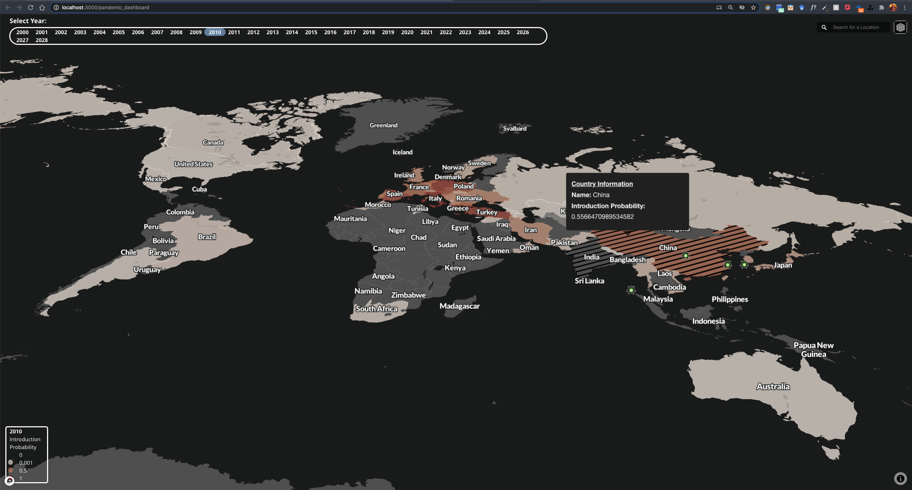

# Pandemic Dashboard

  

  

---

<!-- 

 </img> -->

<!-- ---  -->

## Running the Application 
This project was bootstrapped with [Create React App](https://github.com/facebook/create-react-app).

#### Prerequisites:

1.  Github account and git installed

2. An adequate version of [NodeJS](https://nodejs.org/en/) and npm should be installed. Here is the command to check the installation and version.
    >   `node --version`

    >   `npm --version`

### Getting Started

* __Step 1__: Clone this repository to get the project files: 
    >   `git clone "https://github.com/ncsu-landscape-dynamics/pandemic_dashboard.git"`

* __Step 2__: Go to the project repo: 
    > `cd pandemic_dashboard` 

* __Step 3__: Install local *node_module* dependencies folder: 
    > `npm install`

* __Step 4__: Run the application: 
    > `npm start`

You can now see the app running in the localhost browser popup like this:

 

### Publishing Your Changes to Live Website
* The publication process for this application is automated with [GitHub Actions](https://docs.github.com/en/actions/getting-started-with-github-actions/about-github-actions)
* So when the following commands are run on your local machine, the entire [npm](https://www.npmjs.com/get-npm) publishing process is automatically activated (as specified by this configured [Workflow file](https://raw.githubusercontent.com/ncsu-landscape-dynamics/pandemic_dashboard/master/.github/workflows/deploy.yml))
    * In your terminal / cmd, run your typical GitHub commands to upload your changes:
        > `git add `  
        > `git commit -m "text describing changes / updates" `  
        > `git push `  

* Now, any local changes made to the application will: 
    1. Automatically update remote repository code and files
    2. Compile an optimized application build
    3. Deploy updated build to the [live version](https://docs.github.com/en/actions/getting-started-with-github-actions/about-github-actions) of the application (hosted on Github Pages)
* To monitor the status of your changes, or investigate why a build was unsuccessful, visit this repository's GitHub [Actions](https://github.com/ncsu-landscape-dynamics/pandemic_dashboard/actions) tab 
<!-- Automate your NPM publish with GitHub Actions

    >  `yarn run deploy` 
 
 This command pushes any local changes you've made to the gh-pages branch of the *pandemic_dashboard* remote repository. -->

---

## Authors

* [Garrett Millar](https://github.com/gcmillar)
* [Benjamin Seliger](https://github.com/bjseliger)
* [Chris Jones](https://github.com/ChrisJones687)

---

## License

Permission to use, copy, modify, and distribute this software and
its documentation under the terms of the GNU General Public License
is hereby granted. No representations are made about the suitability
of this software for any purpose. It is provided "as is" without express
or implied warranty. See the
[GNU General Public License](https://www.gnu.org/licenses/old-licenses/gpl-2.0.html)
for more details.

<!-- 

### Available Scripts
Once the repository is cloned or downloaded to local machine, in the project directory, you can run:

`
npm start
` 
* Runs the app in the development mode. 
* Open [http://localhost:3000](http://localhost:3000) to view it in the browser.
* The page will reload if you make edits. 
* You will also see any lint errors in the console.

`npm test`

* Launches the test runner in interactive watch mode. 

`npm run build`

* Builds the app for production to the `build` folder. 
* It correctly bundles React in production mode and optimizes the build for the best performance.
* The build is minified and the filenames include the hashes. 

`npm run deploy`
* Deploys the app to its live link: [Pandemic Dashboard](https://ncsu-landscape-dynamics.github.io/pandemic_dashboard/).

`npm eject`

**Note: this is a one-way operation. Once you `eject`, you can’t go back!**

* If you aren’t satisfied with the build tool and configuration choices, you can `eject` at any time. This command will remove the single build dependency from your project.

* Instead, it will copy all the configuration files and the transitive dependencies (webpack, Babel, ESLint, etc) right into your project so you have full control over them. All of the commands except `eject` will still work, but they will point to the copied scripts so you can tweak them. At this point you’re on your own.

* You don’t have to ever use `eject`. The curated feature set is suitable for small and middle deployments, and you shouldn’t feel obligated to use this feature. 
---

 -->
